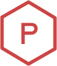

# Parth Chandak - Portfolio Website



[](https://app.netlify.com/sites/parthchandak/deploys)

**Personal portfolio website of Parth Chandak** - Creative Technologist specializing in autonomous vehicle experiences.

🌐 **Live Site**: [parthchandak.com](https://parthchandak.com)

## 🚀 About

This is my personal portfolio website showcasing my work in:
- **Autonomous Vehicle UX** - Building cutting-edge user experiences for self-driving cars
- **Manufacturing Engineering** - MES/MRP/ERP systems and automation solutions  
- **Research** - Published work on haptic feedback systems
- **Creative Technology** - Hardware & software prototyping

## 🛠️ Built With

- **Gatsby.js** - React-based static site generator
- **Styled Components** - CSS-in-JS styling
- **GraphQL** - Data layer management
- **Netlify** - Hosting and deployment

## 🎨 Design

This website is a customized version of the beautiful portfolio template originally designed and built by [Brittany Chiang](https://brittanychiang.com). 

**Original Design**: [github.com/bchiang7/v4](https://github.com/bchiang7/v4)

## 📝 License

This project is licensed under the MIT License - see the [LICENSE](LICENSE) file for details.

Original design by Brittany Chiang, customized and adapted by Parth Chandak.

## 🚀 Quick Start

```bash
# Install dependencies
npm install

# Start development server
npm start

# Build for production
npm run build
```

## 📞 Contact

- **Email**: [parth.chandak02@gmail.com](mailto:parth.chandak02@gmail.com)
- **LinkedIn**: [linkedin.com/in/parthchandak02](https://www.linkedin.com/in/parthchandak02)
- **Schedule Meeting**: [tiny.cc/parthchandakbook](https://tiny.cc/parthchandakbook)
- **Resume**: [tiny.cc/parthchandakresume](https://tiny.cc/parthchandakresume)
